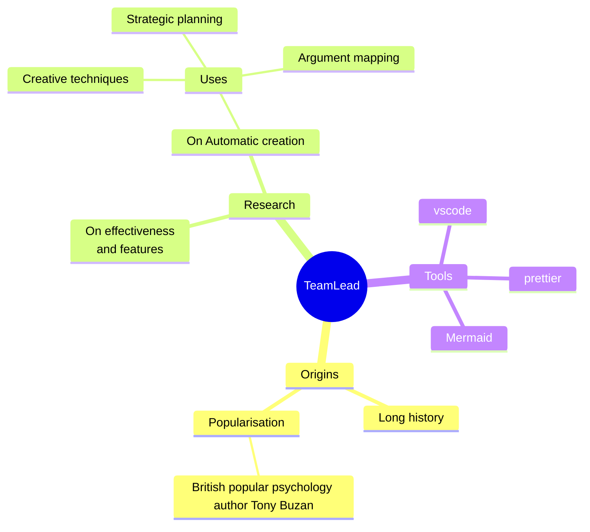

# Git-Adventure
first steps with github, git and md-Syntax ... and more

[git help](/git-help.md)

# WIP: best practices for TeamWork
````"Lets learn something new everyday"````

## Parts, structures and people

 1. [Goal](/###1-goal)
 2. [Language](/###2-language)
 3. [Tools](/###3-tools)
 4. [Guideline](/###4-guideline)
 5. [Teamlead](/###5-teamlead)

### 1. Goal 
- Clear defined goal with defined milestones
### 2. Language
- Naming conventions
### 3. Tools
- Common ground for everyone
### 4. Guideline
- Structured base for a good start, like a well documented HTML file and a predefined CSS-Stylesheet.
- Formatting options (editorconfig for "prettier")
- ?
### 5. Teamlead
- CommunicationHub
- GitHub Repository / Safetynet / Support
- ?

### Lets try Mindmap via Mermaid in md
[Mermaid](https://mermaidjs.github.io/)


