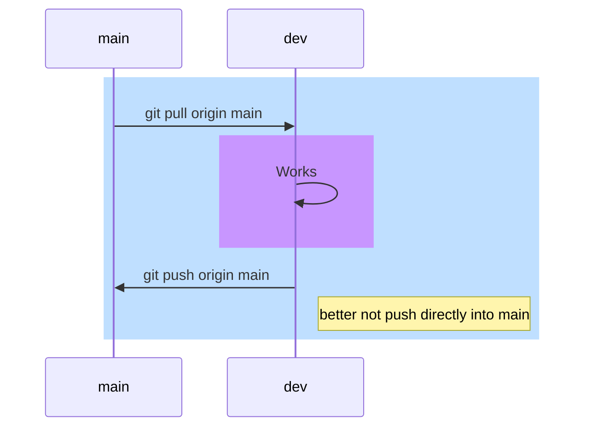

# Git-Adventure
first steps with github, git and md-Syntax ... and more to come

[git help](/git-help.md)
# WBS Coding School
Lets learn something new everyday

### Lets try UML in md-Syntax
You can render diagrams using [Mermaid](https://mermaidjs.github.io/). 

Sequence diagram of "bad git"-use, depending on teamsize and project:

